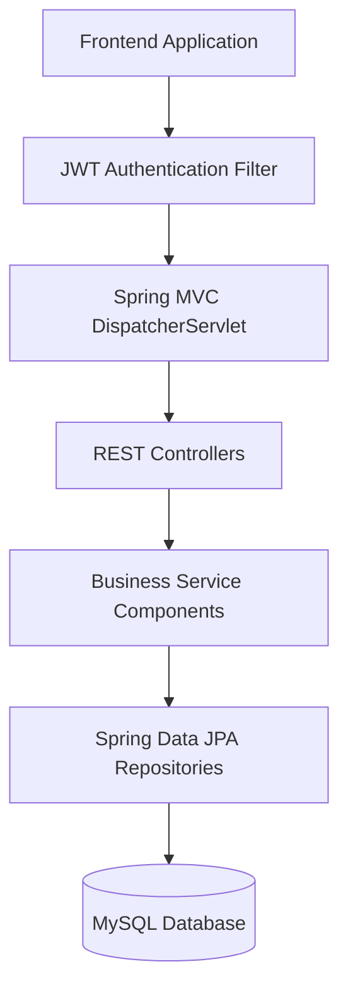
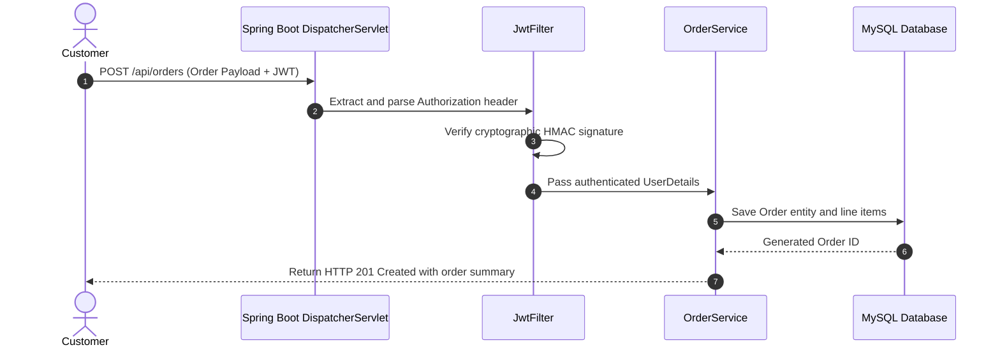

# E-Commerce REST API Backend — Enterprise Spring Boot Service

[]()
[]()
[]()

## Overview
The canonical enterprise backend service for the e-commerce application suite. Implemented using Java 17, Spring Boot, Spring Security, and Spring Data JPA, this service manages core identity, customer authorization, product management, and order lifecycle persistence.

## Features
- **Stateless Authentication:** Secure JWT issue, parse, and validation pipeline.
- **Product Catalog Management:** CRUD APIs for product stock, categories, and pricing.
- **Shopping Cart & Checkout:** Persistent order creation and checkout processing.
- **Role-Based Permissions:** Admin vs. Customer authorization boundaries.

## Architecture


## User Flow


## Technology Stack
| Layer | Technology | Purpose |
|---|---|---|
| Language | Java 17 | Core enterprise programming language |
| Framework | Spring Boot 3 | Web MVC and dependency injection |
| Security | Spring Security, JJWT | Stateless authentication filter chain |
| Persistence | Hibernate, Spring Data JPA | Entity relational mapping |
| Database | MySQL 8.0 | Transactional relational storage |

## Infrastructure
- **Server Port:** 8080
- **Database Port:** 3306 (MySQL)
- **Protocol:** HTTP/1.1 REST JSON

## Project Structure
```text
Backend/
├── src/
│   ├── main/
│   │   ├── java/com/klu/ecommerce/
│   │   │   ├── controller/      # AuthController, ProductController, OrderController
│   │   │   ├── model/           # User, Role, Product, Order Entities
│   │   │   ├── repository/     # Data access repositories
│   │   │   ├── security/       # JwtUtil, SecurityConfig, JwtFilter
│   │   │   └── service/        # Business logic services
│   │   └── resources/
│   │       └── application.properties # Spring configuration
├── pom.xml                      # Maven configuration
├── .env.example                 # Environment template
├── .gitignore                   # Git ignore definitions
└── README.md                    # Technical documentation
```

## Prerequisites
- JDK 17
- Apache Maven >= 3.8
- MySQL 8.0

## Environment Variables
Copy `.env.example` to `.env` and configure placeholders:
```properties
SPRING_DATASOURCE_URL=jdbc:mysql://localhost:3306/ecommerce_db
SPRING_DATASOURCE_USERNAME=root
SPRING_DATASOURCE_PASSWORD=your_mysql_password_here
JWT_SECRET=your_secure_256_bit_jwt_secret_here
SERVER_PORT=8080
```

## Local Development Setup
1. Clone repository:
   ```bash
   git clone https://github.com/Bhanutejanallamothu/Backend.git
   cd Backend
   ```
2. Initialize database:
   ```sql
   CREATE DATABASE ecommerce_db;
   ```
3. Build and launch:
   ```bash
   ./mvnw spring-boot:run
   ```

## Docker Setup
*Not detected in repository. Use Dockerfile from `back` repository for container deployments.*

## Database Setup
Hibernate automatically creates tables on first startup (`spring.jpa.hibernate.ddl-auto=update`).

## API Documentation
- `POST /api/auth/register` - Create new customer account.
- `POST /api/auth/login` - Authenticate and return JWT token.
- `GET /api/products` - Retrieve list of active catalog products.
- `POST /api/products` - Create new product (Admin authorization required).
- `POST /api/orders` - Submit order with items and delivery address.

## Deployment
Package executable JAR:
```bash
./mvnw clean package -DskipTests
java -jar target/ecommerce-0.0.1-SNAPSHOT.jar
```

## Security
- Passwords salted and hashed with BCrypt.
- Protected endpoints require Bearer JWT header validation.
- SQL queries parameterized via Hibernate JPA.

## Testing
Run test suite:
```bash
./mvnw test
```

## Troubleshooting
- **Connection Refused to MySQL:** Ensure MySQL service is running on `127.0.0.1:3306`.

## Future Improvements
- Swagger / OpenAPI documentation auto-generation (`springdoc-openapi`).
- Stripe or Razorpay payment gateway integration.

## License
All rights reserved by repository owner.
